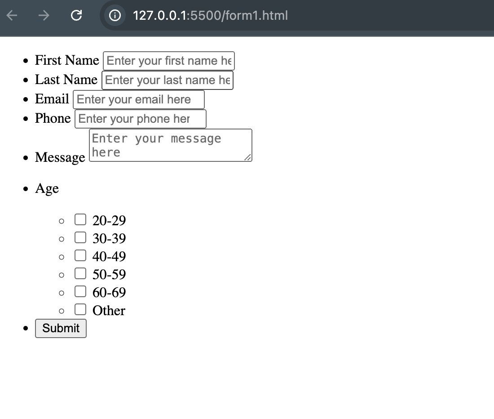
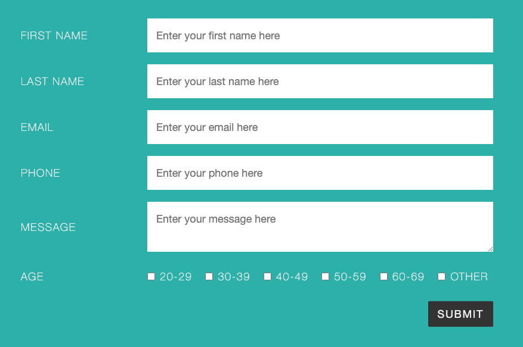

# UIC_CS422_bootcamp_2025

## 25.01.22 Exercise 1

In the first bootcamp, we will create a basic information form and add style for it step bu step.

1. **Create the Form Structure:** Begin by constructing the form using basic HTML tags such as `<form>`, `<ul>`, `<li>`, `<label>`, `<input>`, and `<button>`. This establishes the foundational structure and ensures all necessary form elements are included.

2. **Enhance Responsiveness with Flexbox:** Update the HTML layout by incorporating Flexbox. This step ensures the form adapts seamlessly to different screen sizes and provides a flexible and visually balanced arrangement of elements.

3. **Apply Styling with CSS:** Add CSS to style the form, improving its visual appeal and usability. Use properties like padding, margins, colors, and box shadows to create a clean, user-friendly design.

