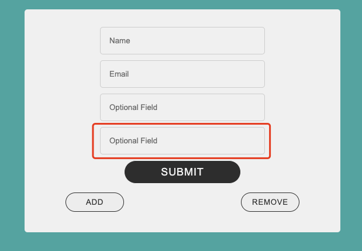

# UIC_CS422_bootcamp_2025

## [25.01.22] Exercise 1

In the first bootcamp, we will create a basic information form and add style for it step bu step.

1. **Create the Form Structure:** Begin by constructing the form using basic HTML tags such as `<form>`, `<ul>`, `<li>`, `<label>`, `<input>`, and `<button>`. This establishes the foundational structure and ensures all necessary form elements are included.

2. **Enhance Responsiveness with Flexbox:** Update the HTML layout by incorporating Flexbox. This step ensures the form adapts seamlessly to different screen sizes and provides a flexible and visually balanced arrangement of elements.

3. **Apply Styling with CSS:** Add CSS to style the form, improving its visual appeal and usability. Use properties like padding, margins, colors, and box shadows to create a clean, user-friendly design.

## [25.01.29] Exercise 2

The second bootcamp will focus on JavaScript techniques, including event handling, DOM manipulation, and basic validation patterns.

### Example - Form Validation

This example focuses on creating a web form with client-side validation using JavaScript. The form includes fields such as first name, last name, email, phone number, a message textarea, and age group checkboxes. 

The validation script ensures that all required fields are completed before submission, providing dynamic feedback for invalid inputs. It highlights errors by displaying warning messages next to the fields and applying a visual indicator (e.g., a red border). 

The validation logic prevents form submission until all requirements are met, ensuring data integrity and improving user experience. 

### Exercise - Dynamic Form Fields

The exercise features a simple form with default fields for Name, Email, and an Optional field, along with Add and Remove buttons. When clicking Add, JavaScript creates a new input field, and Remove deletes the last optional field while preserving the essential Name and Email fields.

